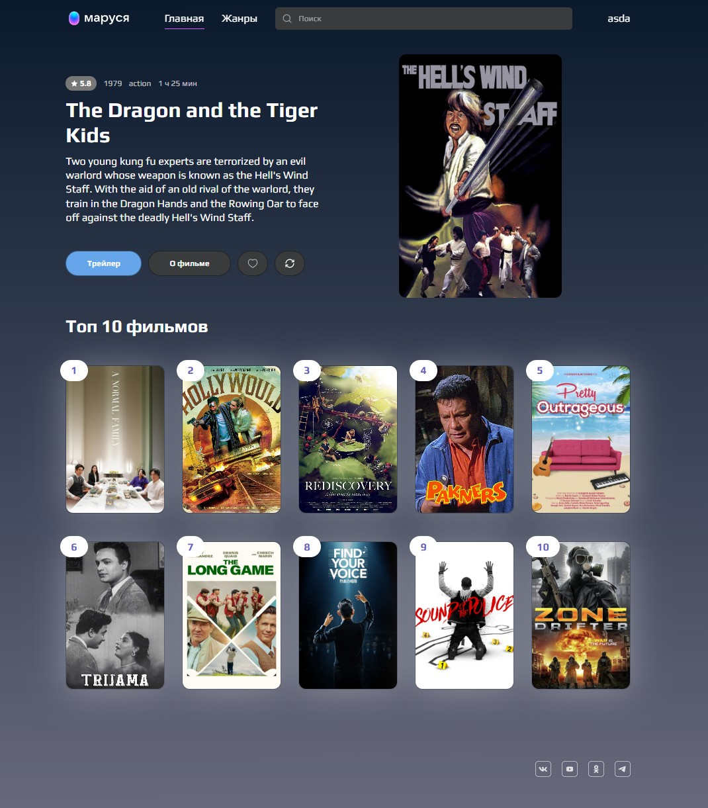
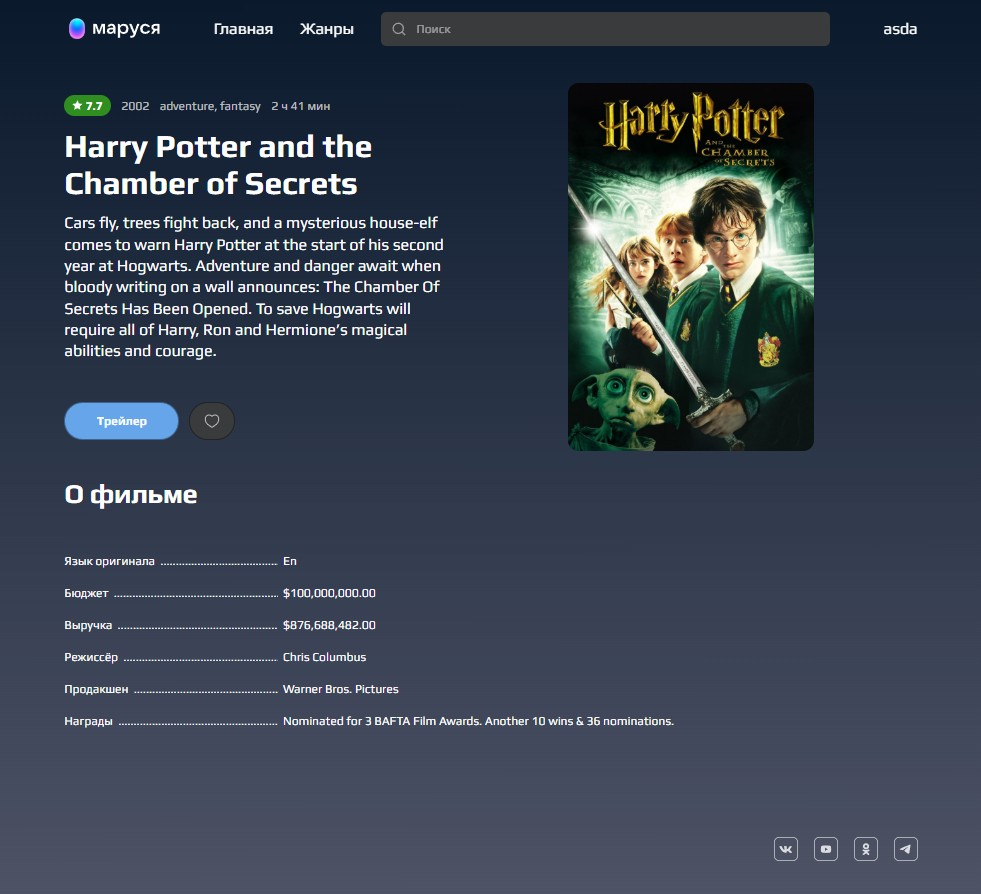
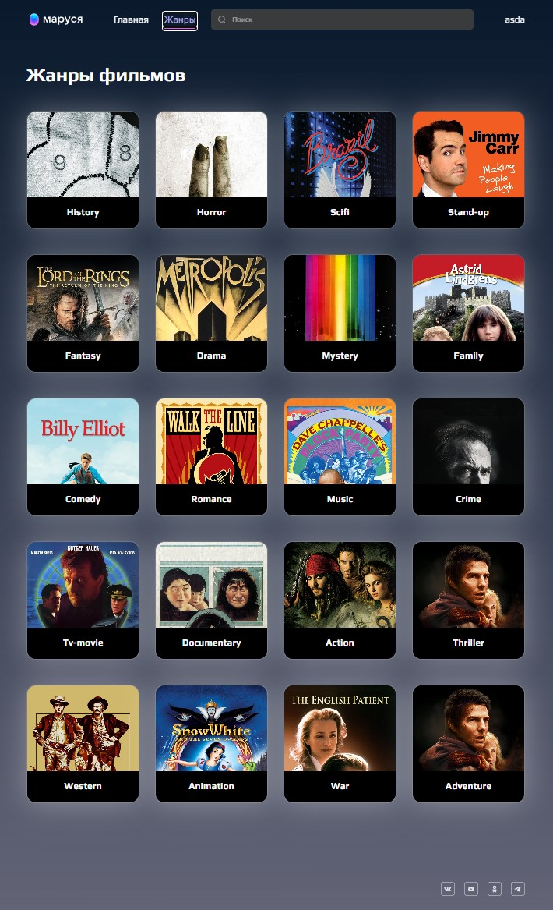

# Movies Guide🎥

📸 Скриншоты:

<div>
  <br>
  <br>
  <br>
</div>

✨ Возможности
- Просмотр случайного фильма
- Поиск фильмов по названию
- Просмотр подробной информации о фильме
- Авторизация и регистрация пользователя
- Добавление и удаление фильмов из избранного
- Работа с защищёнными маршрутами
- Валидация форм
- Обработка загрузки и ошибок API
- Адаптивный интерфейс

🔗 Установка:

Установка зависимостей:
```sh 
npm install
```
Запуск сервера разработки:
```sh
npm run dev
```
Запуск production сборки:
```sh
npm run build
```

Preview:
```sh
npm run preview
```

🛠️Stack:
- React		
- React Router
- React Query
- Redux Toolkit
- React Hook Form
- Zod
- TypeScript
- Sass
- Vite
